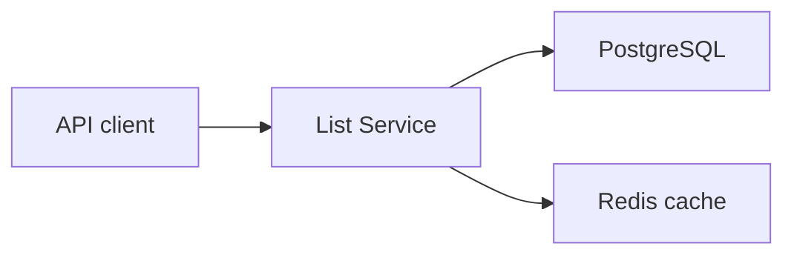

# Architecture Notes

## Current Foundation

The List Service owns the catalog read model for the local foundation. It keeps product data in PostgreSQL and stores immutable price observations in `price_history`. Redis is intentionally short-lived cache, not a source of truth.

## Why This Maps To AWS Later

- PostgreSQL maps to Amazon RDS PostgreSQL.
- Redis maps to Amazon ElastiCache or MemoryDB.
- List Service maps to ECS Fargate behind an ALB.
- File import can move from `POST /imports/products` to S3 object-created events and Lambda.
- Price history can remain in RDS initially, then PriceGraph Service can expose chart-ready read APIs.
- Selection state can move into Redis for anonymous sessions or DynamoDB for durable user selections.

## Planned Service Boundaries

- List Service: product browse and product detail reads.
- Search Service: indexing and search relevance, likely fed from product updates.
- PriceGraph Service: price-history reads and aggregations.
- Select Service: selected product/session state.
- Import Worker: validates S3 files and calls import flow or publishes normalized product events.
